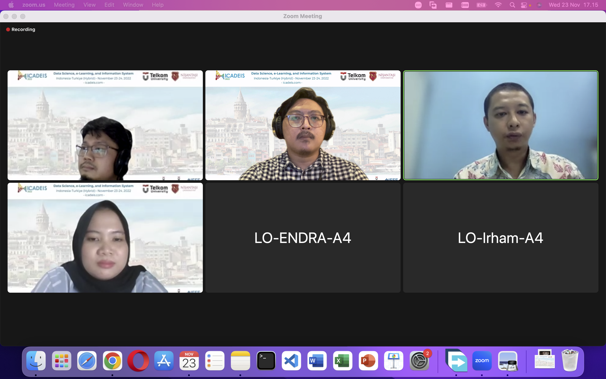
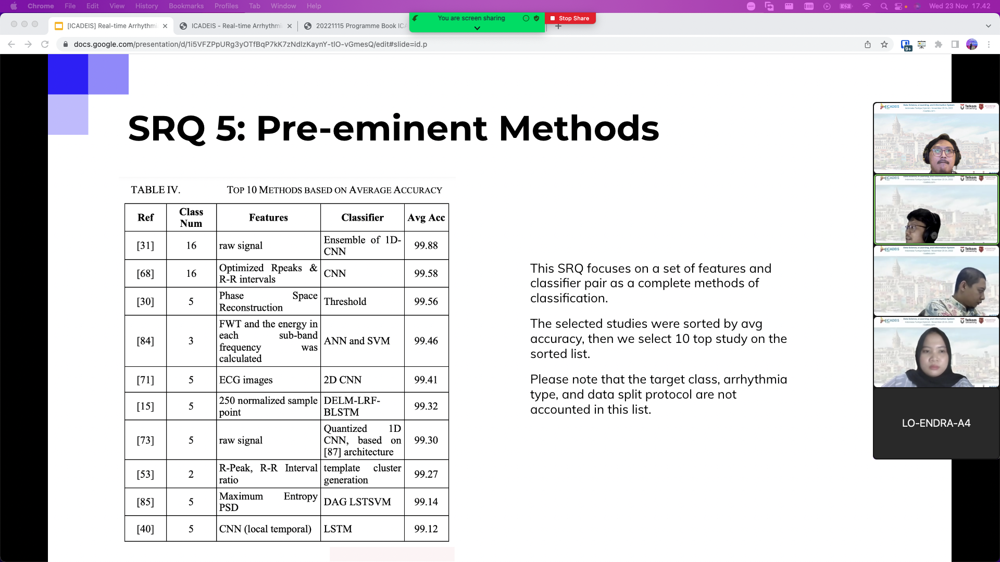

Our paper got accepted to be presented in ICaDEIS 2022. The paper was titled: "Eploration of ECG-based Real-time Arrhythmia detection: A Systematic Literature Review".

The paper discuss an identification and synthesis of studies in the scope of ECG-based Real-time Arrhythmia Detection. The paper was presented in Nov, 23rd by Ilham. 

