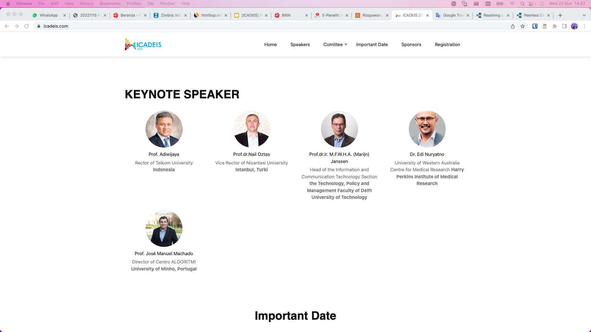
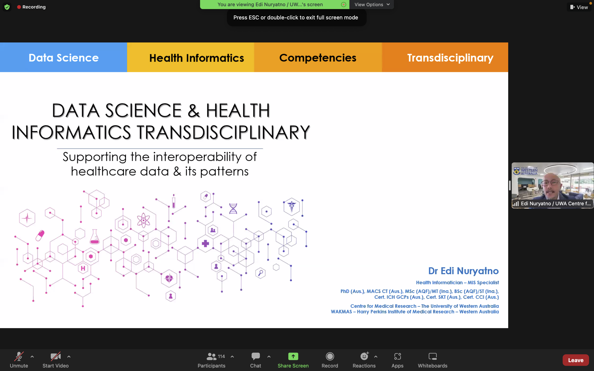
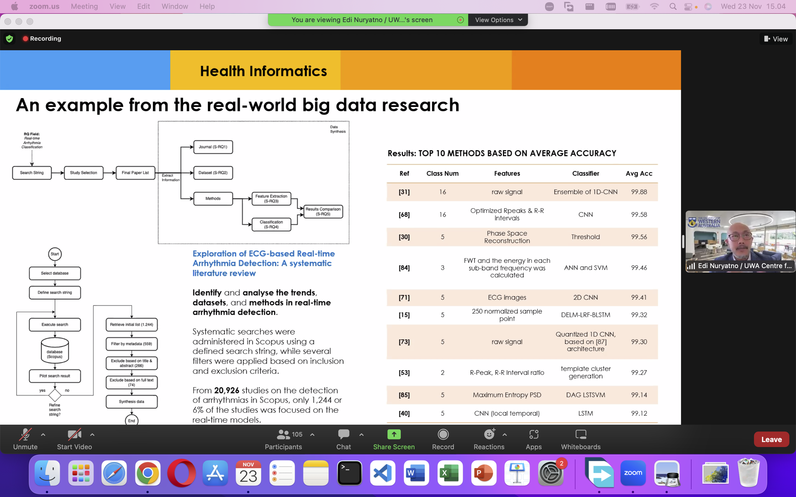

Dr. Edi Triyono Nuryatno was invited as a keynote speaker to The International Conference on Advancement in Data Science, e-Learning,  and Information System (ICaDEIS 2022).

In the keynote session, Dr. Edi discuss about "Data Science & Health Informatics Transdisciplinary: Supporting the ineroperability of healthcare data & its patterns".

Great kudos to Dr. Edi! :D